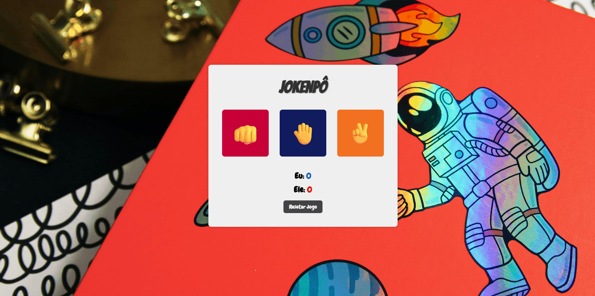
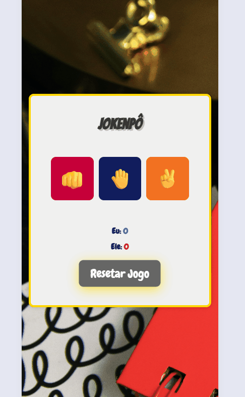

# 🎮 JokenPô

Jogo simples de Pedra, Papel e Tesoura feito com HTML, CSS e JavaScript. O usuário joga contra o computador, que faz escolhas aleatórias, e o placar é atualizado dinamicamente na tela.

---

🔗 Acesse o projeto online: [Clique aqui para jogar JokenPô](https://analiceferreirads1.github.io/PROJETO-JOKENPOW/)


## 🛠 Tecnologias

- HTML5  
- CSS3      
- JavaScript (ES6)

---

## 📚 O que aprendi com este projeto

Durante o desenvolvimento deste projeto, que faz parte do aprendizado no curso FullStack - DevClub, consolidei vários conhecimentos essenciais para minha formação como desenvolvedora Front-End e futura Full Stack. Entre eles:

- **Manipulação do DOM (Document Object Model):** Acesso e modificação de elementos HTML via JavaScript para atualizar o conteúdo dinamicamente (ex: placar e resultado do jogo).
- **Eventos e interação com o usuário:** Captura de cliques e outras ações para controlar a lógica do jogo.
- **Lógica de programação aplicada:** Uso de estruturas condicionais `if`, `else if` e `else` para implementar as regras do jogo.
- **Arrays e números aleatórios:** Armazenamento das opções do jogo em arrays e uso da função `Math.random()` para escolhas aleatórias do computador.
- **Estruturação e semântica do HTML:** Organização do conteúdo com tags semânticas para acessibilidade e clareza.
- **Estilização CSS responsiva:** Uso de `media queries` para adaptar o layout a diferentes tamanhos de tela.
- **Gerenciamento de estado e atualização da interface:** Manutenção da pontuação via variáveis e atualização em tempo real na interface.
- **Versionamento de código com Git e GitHub:** Prática de commits claros e envio para o GitHub, entendendo a importância do controle de versões.
- **Boas práticas de código e organização:** Separação clara entre os arquivos HTML, CSS e JavaScript, mantendo o código limpo e organizado.

🧠 Este projeto foi fundamental para transformar conceitos teóricos em prática real, preparando-me para desafios profissionais no desenvolvimento web.

---

## 📁 Estrutura do Projeto

```bash
PROJETO-JOKENPOW/
├── index.html               # Arquivo principal HTML
├── style.css                # Arquivo CSS para estilos
├── script.js                # Arquivo JavaScript com a lógica do jogo
├── README.md                # Arquivo de documentação
└── assets/                  # Pasta para imagens e outros recursos
    └── background-space.png # Imagem de background usada no projeto
  
  ```

## 🚀 Como usar


Clone este repositório:

```bash
git clone https://github.com/analiceferreirads1/PROJETO-JOKENPOW.git
```

Entre na pasta do projeto:
```bash
cd PROJETO-JOKENPOW

```


🧩 Funcionalidades

- Escolha entre Pedra, Papel ou Tesoura

- O computador escolhe aleatoriamente

- O placar é atualizado com vitórias do jogador e da máquina

- Mensagem indicando vitória, derrota ou empate

- (Opcional) Botão para resetar o jogo


## 📺 Demonstração

Veja a aplicação em funcionamento no desktop:



## 📱 Versão Responsiva

A interface também foi adaptada para funcionar corretamente em dispositivos móveis:




## 👩‍💻 Autora
- **Nome:** Analice Ferreira  

## 💬 Feedback

Ficarei feliz em receber feedbacks, sugestões ou colaborações! 😊  

- **Email:** [analiceferreirads12@gmail.com](mailto:analiceferreirads12@gmail.com)  
- **GitHub:** [@analiceferreirads1](https://github.com/analiceferreirads1)
